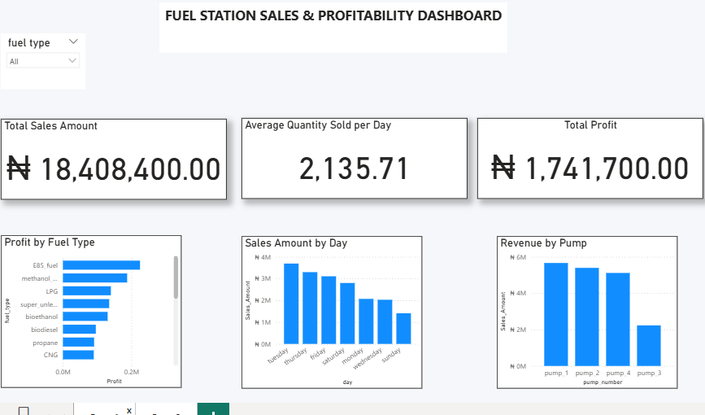
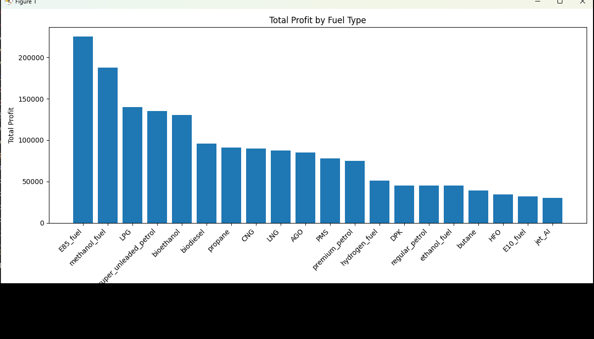
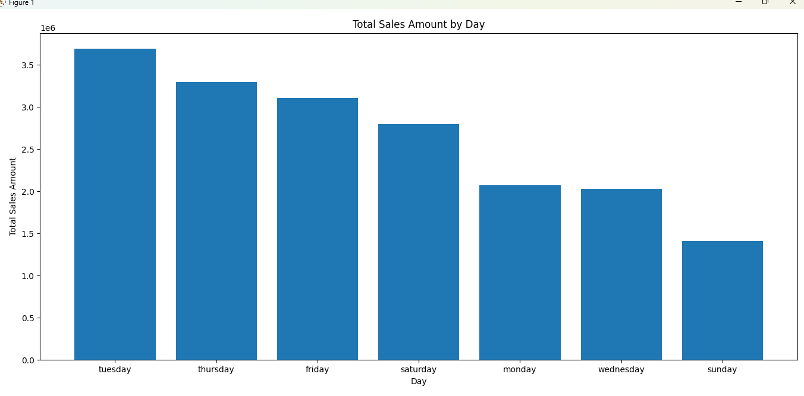

 Fuel Station Sales Analysis

 Project Overview

This project analyzes fuel station sales and profitability using Python and Power BI. It explores sales performance, profit generation, fuel types, daily sales trends, and pump revenue to support data-driven business decisions.

Note: The dataset used in this project is simulated for learning and portfolio demonstration purposes. It does not represent actual fuel station transactions.

 Business Questions

* Which fuel type generates the highest profit?
* Which day records the highest sales amount?
* Which pump generates the highest revenue?
* What is the total sales amount and total profit?
* How does sales performance vary across fuel types, days, and pumps?

 Tools Used

* Python
* Pandas
* Matplotlib
* Power BI

 Key Performance Indicators (KPIs)

* Total Sales Amount: ₦18,408,400
* Total Profit: ₦1,741,700
* Average Quantity Sold per Day: 2,135.71 units

 Key Findings

* Highest-profit fuel type: E85 fuel, generating ₦225,000 in profit.
* Highest-sales day: Tuesday, with sales of ₦3,692,500.
* Highest-revenue pump: Pump 1, generating ₦5,664,600.
* The analysis compares sales, profit, and quantities across fuel types, days, and pumps to highlight performance differences.

 Project Files

* `data/` — Contains the simulated fuel station dataset in CSV format.
* `python/` — Contains the Python analysis script.
* `dashboard/` — Contains the Power BI dashboard file.

 Dashboard Features

The Power BI report contains two pages:

1. Main Dashboard: Presents key performance indicators and an overview of sales and profitability.
2. Detailed Analysis: Provides deeper comparisons of fuel types, sales days, and pump performance.

Interactive slicers are available in the Power BI report.

 Conclusion

This project demonstrates how Python and Power BI can be used together to clean, analyze, visualize, and communicate sales data. The findings show how performance analysis can help identify profitable fuel types, strong sales days, and high-performing pumps.

 Author

Azoro Onyinyechi Favour

 Project Visualizations

 1. Main Power BI Dashboard

 2. Detailed Power BI Analysis

 3. Python Profit by Fuel Type

 4. Python Sales Amount by Day

